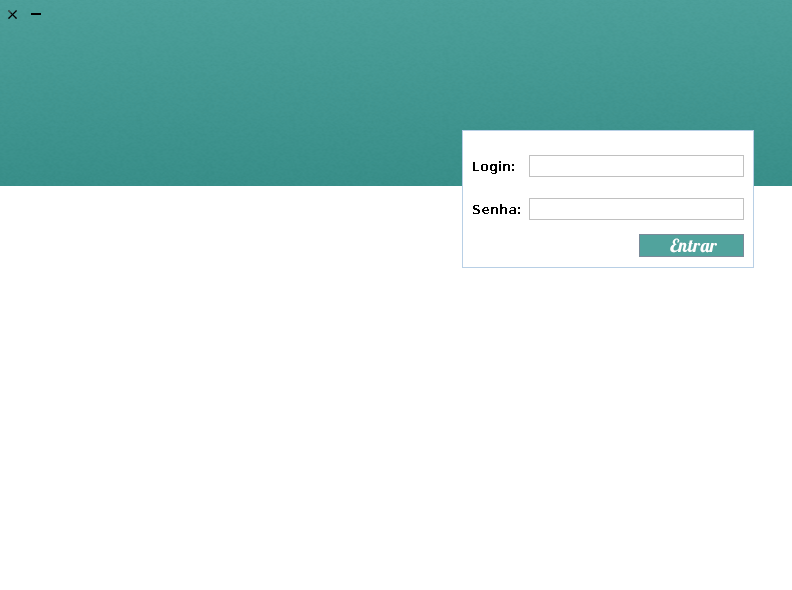
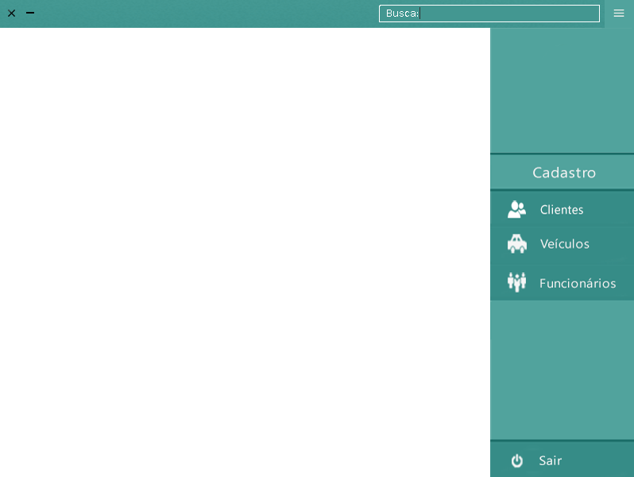
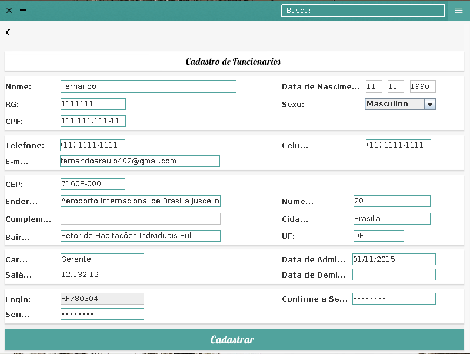

# linkey

Projeto primeiro semestre do curso técnico.

Programa para gerenciar uma concessionária.

##Utilizado
#####Linguagem 
Java 7 - JDK 7 

#####Interface gráfica
Swing

#####Frameworks
jsoup - Trazer dados a partir do CEP.

MySQL Connector - Realizar conexão com o banco de dados.

##Algumas telas

